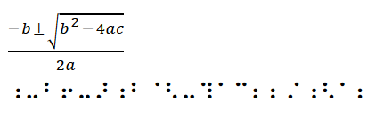

# mathml2braille
Converti les équations mathML, ou du texte (braille direct), en braille Unicode.



## mathML
* Convertir toutes les équations
```
mathml2braille();
```
* Ne convertir que les éléments d'une classe
```
mathml2braille('.class');
```
## Braille Direct
* Transformer du texte en braille unicode
```
<p class="js-brailleDirect">>5+25;/58=65</p>
⠰⠱⠖⠣⠱⠆⠌⠱⠳⠶⠫⠱
```
```
brailledirect('.js-brailleDirect');
```
* Les tables de caractères sont basées sur celles du logiciel [Duxbury DBT Win](http://www.duxburysystems.com/). Pour l'instant il n'y a que les tables française et américaine.
## Langues
* Le choix de la table de caractères est basé sur la langue définie sur l'équation ou, par défaut, celle du document
```
<math xmlns="http://www.w3.org/1998/Math/MathML" lang="en" xml:lang="en">
```
sinon
```
<html xmlns="http://www.w3.org/1999/xhtml" xml:lang="fr" lang="fr">
```